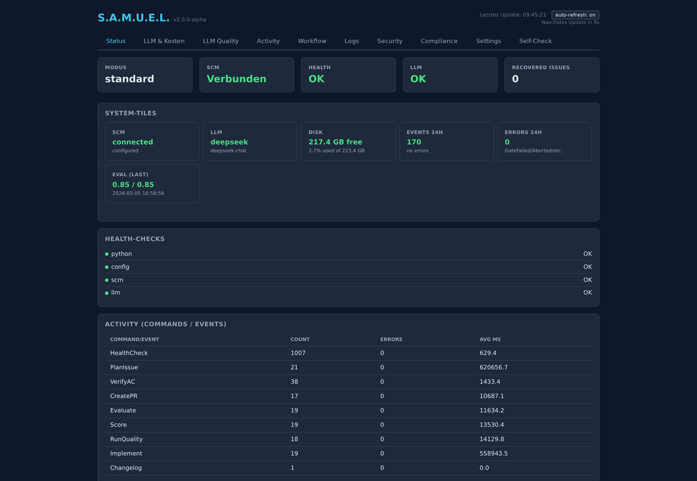
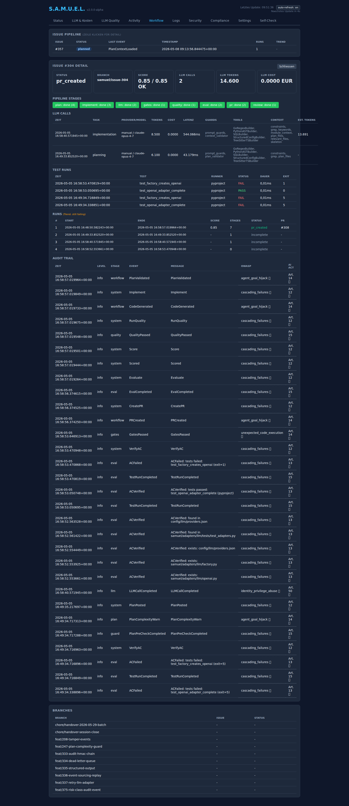
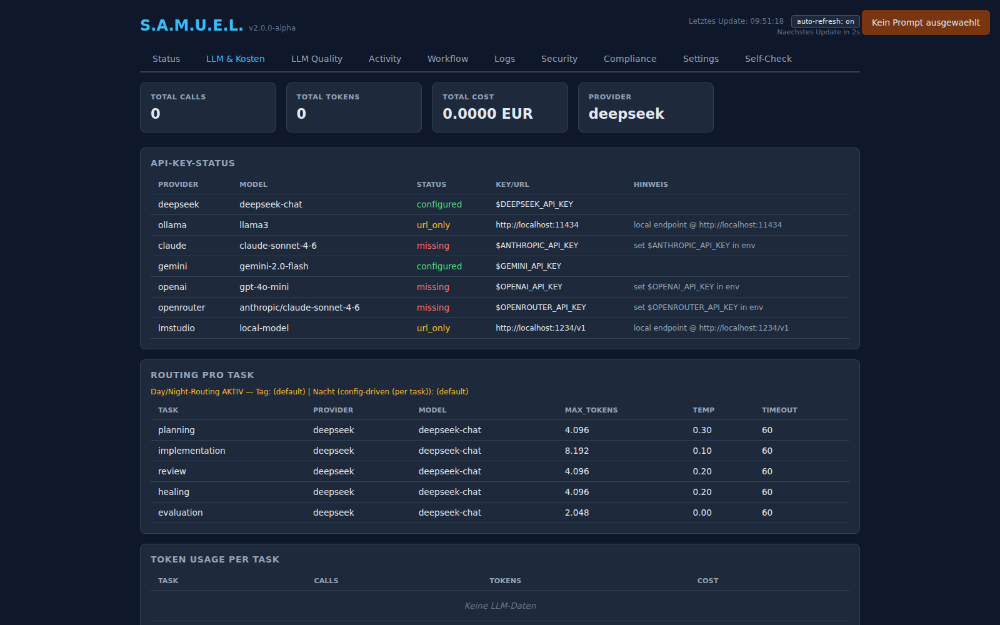
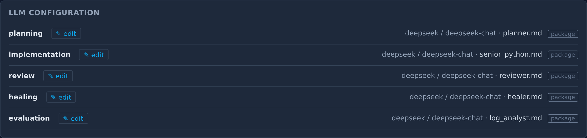

> **Public snapshot (2026-10-08):** Reviewed, non-authoritative projection of current development after v2.0.0a27, including CRA/GDPR advisory mappings, Documentation Extension guidance and the OCI verifier/Doctor implementation (#978). The a27 release remains separately bound to its original source. See [PUBLIC_SNAPSHOT.md](PUBLIC_SNAPSHOT.md).

# S.A.M.U.E.L.

S.A.M.U.E.L. ist eine modular aufgebaute Prüf- und Nachweisschicht mit einem
integrierten Referenz-Worker für die Strecke Issue → Pull Request. Das System
bindet die PR-Prüfung an ein konkretes Repository sowie vollständige Base- und
Head-SHAs; welche Kontrolle dabei tatsächlich blockiert, nur warnt oder noch
nicht verdrahtet ist, wird ausdrücklich getrennt ausgewiesen.

Das System integriert sich in bestehende Team-Workflows auf **GitHub** und
**Gitea**. LLM-Ausgaben werden als nicht vertrauenswürdig behandelt. Der
heutige Referenz-Worker teilt den Approval-, Subject- und Gatepfad bereits mit
passiv eingereichten Git-Candidates. Eine allgemeine aktive
Fremdworkersteuerung ist erst bei einem tatsächlichen zweiten Adapterbedarf
Teil des Produktvertrags (#521, D05/D07).

> ⚠️ **Release- und Qualificationstatus:** Für neue Testinstallationen gilt
> der neueste veröffentlichte Alpha-Release mit seinem verifizierten Manifest.
> Am 06.10.2026 ist a27 veröffentlicht; dessen unabhängige OCI-Erstinstallation
> aus den veröffentlichten Dateien ist PASS (#970/#971).
> Die Release Notes binden Tag, vollständigen Commit, Assets und OCI-Digest.
> Der offizielle OCI-Installationsweg verwendet dessen OCI-Kit und Compose-
> Dateien; siehe [INSTALL, Abschnitt 9.1](docs/INSTALL.md#91-oci-erstinstallation-auf-einem-leeren-docker-host-970).
> Installation und technische Health bestätigen keinen Golden-/D0-PASS
> oder Supportclaim. Die nach #962 übertragenen Altlastenabnahmen bleiben
> getrennt; administrative Issueabschlüsse behaupten keinen Abnahme-PASS.
> Die Veröffentlichung bestätigt keinen vollständigen Funktions- oder D0-PASS.

Die kurze Projekthese, der belegte Alpha-Iststand und die bewusst offene
Richtung stehen im [S.A.M.U.E.L. Manifest](MANIFESTO.md): **Trust the change,
not the producer.** Das Manifest ist keine technische Runtime-Spezifikation.

Die Langform des Namens lautet „Sicheres Autonomes Mehrschichtiges
Ueberwachungs- und Entwicklungs-Logiksystem“. „Autonom“ beschreibt dabei den
optionalen Worker-Ablauf, nicht eine Sicherheits- oder Compliance-Garantie.

**Andockbar an eigene Systeme (Ports & Adapters):** externe Systeme sprechen nur
ueber Ports und sind als Adapter austauschbar — SCM (aktuell **GitHub** und
**Gitea**; weitere Workflow-/Repo-Tools sind geplant), LLM-Provider, Audit-Sinks,
Benachrichtigungen und das Dashboard/die REST-API lassen sich so an die eigene
Infrastruktur anbinden, ohne den Kern zu aendern.

---

## Wofuer S.A.M.U.E.L. da ist

Entwicklerteams beschreiben Aufgaben in Issues. S.A.M.U.E.L. greift Issues mit
einem Workflow-Label, plant die Loesung, schreibt den Code, prueft das
Ergebnis und oeffnet einen Pull Request. Der Mensch bleibt im Review-Loop —
aber Recherche, Boilerplate, Tests und Linter-Roboterarbeit sind weg.

S.A.M.U.E.L. ist gebaut fuer Teams, die:

- LLM-Output nachvollziehbar prüfen und für eigene Audits dokumentieren wollen
- mit **mehreren LLM-Providern** arbeiten wollen (lokal + Cloud, Cost-Saving im Nacht-Schedule)
- klar unterscheiden müssen, welche Kontrolle blockiert, warnt oder nur misst
- den Bot **nachvollziehbar** im Repo arbeiten lassen wollen, mit jedem Schritt als Audit-Event

Was S.A.M.U.E.L. nicht ist: kein Code-Assistent in der IDE, kein interaktiver
Chatbot, kein Generic-Function-Caller. Der Fokus liegt auf der
**End-to-End-Strecke Issue → PR** im Team-Repo. S.A.M.U.E.L. erteilt keine
Compliance-Zertifizierung; die Rechts- und Betriebsbewertung bleibt
deploymentabhängig.

---

## Wie ein Issue durch S.A.M.U.E.L. laeuft

Die zusammenhängende, codegenaue Ablaufseite mit Werkzeugen, Authority,
Status-/Fehlersemantik und den für a15 erhaltenen realen Teilnachweisen liegt
unter
[`technische Beschreibungen/README.md`](technische%20Beschreibungen/README.md).
Grüne Unit-/Integrationstests sind dort bewusst von einer vollständigen
Installation-zu-PR-Qualification nach #658 getrennt; wesentliche Änderungen
der Referenzkombination verlangen einen neuen Lauf.

```
Issue (GitHub/Gitea)
  │
  ▼
┌────────────┐    ┌──────────────┐    ┌────────────┐    ┌─────────────────┐
│  Planning  │───▶│Implementation│───▶│ PR-Gates   │───▶│ PR / Block      │
└────────────┘    └──────────────┘    └─────┬──────┘    └─────────────────┘
   │                  │                     │
   ▼                  ▼                     ▼
Worker-Prüfungen  Patch-Verarbeitung   gebundene Evidence
                                             │
                                             └──▶ passive Evaluation
```

**Das Prinzip: Defense in Depth.** Ein registrierter Mechanismus ist nicht
automatisch eine wirksame Schranke. Deshalb gelten diese Leitlinien als Ziel
und jede Abweichung wird in der Matrix sichtbar:

- **Fail-closed am benannten Prüfgegenstand** — fehlende oder unvollständige
  Commit-Daten blockieren die PR-Gate-Auswertung.
- **Human-in-the-Loop als Deployment-Vertrag** — Standard-, Watch-, Chat- und
  Self-Workflow warten auf Planfreigabe; Autonomous-, Night- und Patch-
  Workflow tun dies nicht. Technische Gates prüfen den Candidate, ersetzen
  aber keinen menschlichen Review. Merge-Policy und Branch-Schutz müssen im
  Ziel-SCM wirksam nachgewiesen werden.
- **Technisch, nicht durch Vertrauen** — Prompt-Anweisungen gelten nur als
  Signal; technische Policy muss außerhalb des Modells greifen.
- **Nachweis mit Grenzen** — Bus-Calls tragen Correlation-IDs. Eine HMAC-Kette
  entsteht nur bei gesetztem `SAMUEL_AUDIT_HMAC_KEY`. Vorhandene
  Gitea-SCM-Checks können über `samuel evidence assess` begrenzt,
  subjectgebunden und ausschließlich advisory bewertet werden; bindende,
  auftragsgebundene Provider-Evidence bleibt #679.

Die Schranken einer Stufe sind unten kurz benannt; die stufen­uebergreifenden
folgen als *Quer-Schranken*.

### 1. Planning — Issue → Plan

Ein LLM erstellt aus dem Issue einen strukturierten Plan: Aufgaben,
Akzeptanzkriterien, betroffene Dateien und Tests. Der heutige Pfad enthält
folgende Prüfungen mit unterschiedlicher Wirkung:

- **SCM-gebundener Planungssnapshot** — der konfigurierte `default_branch`
  wird vor dem LLM einmal auf seine vollständige Commit-SHA aufgelöst und in
  einem detached Verification-Worktree materialisiert. Skeleton, Dateiauszüge,
  Suche und Pre-Checks lesen nur diesen Snapshot. Repository, Ref, SHA und
  Issue-Digest sind systemseitig im Acceptance Contract und seiner Freigabe
  gebunden. Ein fehlender Commit, abweichender Remote-Stand oder späterer
  Base-/Issue-Drift blockiert vor Candidate-Mutation; uncommittete lokale
  Dateien sind keine Quelle.
- **Prompt-Header** — zentral definierte Marker begrenzen die Instruktion, sind aber nur
  eine Prompt-Layer-Maßnahme und keine technische Injection-Schranke.
- **Prompt-Injection-Heuristik** — neun begrenzte Phrasen-/Rollenmuster werden
  nach NFKC-/Casefold- und eingeschränkter Confusable-Normalisierung für die
  Prompts von Planning, Implementation, Healing und Review geprüft. Treffer
  erzeugen begrenzte `PromptInjectionRiskDetected`-Evidence, bleiben advisory
  und sind keine technische Injection-Schranke.
- **Plan-Validator** — der erzeugte Plan wird gescored (Vollstaendigkeit,
  AC-Format, Datei-Pfade); ein formaler Acceptance-Contract-Fehler oder ein
  Score unter 80 triggert denselben einzigen Retry mit konkretem Feedback ans
  LLM. Erstentwurf und Korrektur verwenden dieselbe effektive `planning`-
  Provider-/Modellroute; `planning_retry` bezeichnet nur die Auditphase und
  erzeugt keine implizite Defaultmodellroute. Ein formal gültiger Plan mit
  Score unter 50 blockiert ohne Retry (#733).
- **Plan-Pre-Check / Komplexitaets-Waechter** — Struktur, Skeleton,
  AC-Dry-Run, Issue-Abdeckung und Komplexität werden vor und nach dem Retry
  getrennt ausgewiesen. `PlanValidated` entsteht nur bei vollständig grünem
  `overall_pass`; ein zweiter Fehlschlag blockiert als `pre_check_failed`, eine
  Split-Empfehlung als eigener Grund. Eine im gebundenen Snapshot noch nicht
  vorhandene Datei widerspricht dem Skeleton nur dann nicht, wenn der
  strukturierte Scope genau diesen Pfad autorisiert; bestehende oder
  ungescopte Referenzen bleiben skeletonpflichtig. Im `chat`-Workflow bleibt
  danach Plan-Approval Pflicht.
- **Acceptance-/Scope-Contract** — der ausgewählte Entwurf wird vor jedem
  SCM-Kommentar kanonisch geparst. Ein formal ungültiger Erstentwurf besitzt
  keine Authority und darf genau den vorhandenen Planning-Retry verbrauchen.
  Bleibt auch dessen Contract ungültig, erzeugt nur dieser letzte Entwurf einen
  ausdrücklich nicht autoritativen Entwurfs-/Blockierkommentar, `PlanBlocked`
  und `status:failed`; kein ungültiger Entwurf erzeugt `PlanPosted` oder eine
  Freigabe-Evidence (#695, #731).
- **Plan-als-Kommentar** — der Plan wird als Issue-Kommentar gepostet, *bevor*
  Code geschrieben wird. Voll auditierbar, das Team kann eingreifen.

### 2. Implementation — Plan → Code

Aus dem Plan wird Code in einem begrenzten Multi-Round-LLM-Loop erzeugt. Für
diesen Referenz-Worker gilt derzeit:

- **Context-Builder** — Code-Skeleton-as-TOC und begrenzte File-Slices; ein
  optionaler Context-HMAC wird erzeugt, aber derzeit nicht konsumierend
  verifiziert.
- **PII-Sanitizer** — ersetzt konfigurierte PII-Muster in User-Nachrichten,
  sofern `pii_scrubbing.enabled=true`; er ist kein allgemeiner Secret-Filter.
- **Patch-Parser** — verarbeitet strukturierte sowie SEARCH/REPLACE-Patches;
  alle Python-Operationen einschließlich WRITE werden vor dem sichtbaren Write
  per AST geprüft. JSON-Kandidaten werden ebenfalls vor dem Write vollständig
  validiert, sodass ein fachlich abgelehnter Patch keinen Zwischenstand für
  den Retry hinterlässt. Andere Dateitypen werden mechanisch verarbeitet
  (#601, #606).
- **Gebundene Patchziele** — vor dem ersten Apply einer Modellantwort werden
  alle Text- und JSON-Patchziele als normalisierte relative POSIX-Pfade gegen
  den kanonischen Projektwurzelpfad aufgelöst. Absolute Pfade, `..` und
  Symlink-Ausbrüche blockieren den gesamten Loop vor dem Schreiben als
  `unsafe_patch_target`; Diagnose und Event enthalten nur Reason-Codes und
  Anzahlen. Pfade innerhalb der Projektwurzel, einschließlich neuer
  Unterverzeichnisse, bleiben zulässig. Reservierte `.git`-Bestandteile und
  die einmal pro Loop über Git selbst aufgelösten effektiven Git-/Common-/
  Index-/Object-Pfade sind ebenfalls vor Read, Snapshot und Write geschützt;
  normale Dotfiles bleiben versionierbar (#600, #603).
- **Atomarer Loop-Arbeitsbaum** — vor dem ersten Schreibversuch je Zielpfad
  merkt sich der Referenz-Worker Inhalt, Existenz und Dateimodus. Jedes
  kontrollierte erfolglose Loop-Ende (einschließlich Tokenlimit,
  No-Patch/No-Progress und Exception) stellt diesen Zustand ohne
  `git reset`, Checkout oder Stash wieder her; nur ein erfolgreicher Loop
  behält seine Patches. Ein fehlgeschlagener Restore blockiert ausdrücklich
  als `workspace_rollback_failed`. Die Garantie ist pro laufendem Prozess:
  Ein nur vorsorglich erfasster, nach fachlicher Ablehnung nachweislich
  unveränderter Pfad wird freigegeben und deshalb beim terminalen Rollback
  nicht metadata-verändernd neu geschrieben (#606).
  Prozessabbruch/Neustart (#482) bleibt ein eigener offener Vertrag. Die
  mutationsfreie fachliche Patchablehnung (#601) und die zulässige Zielmenge
  einschließlich lokaler Git-Control-Plane (#600, #603) sind vorgelagerte
  eigene Controls.
- **Expliziter No-Patch-Abbruch** — eine abgeschlossene, nicht truncierte
  Modellantwort ohne strukturiert oder textuell parsbaren Patch endet als
  `WorkflowBlocked(reason=no_parseable_patches)` mit inhaltsfreier
  Runden-/Patchanzahl-Diagnose; sie gilt weder als `complete` noch wird der
  Antwortinhalt in dieser Diagnose persistiert.
- **Secret-Scanner** — ein immer aktives External Gate prüft die hinzugefügten
  Zeilen des vollständigen, commitgebundenen Candidate-Diffs. Hochpräzise
  Signaturen einschließlich PEM-Private-Key blockieren; JWT-Form und
  AWS-Access-Key-ID starten advisory mit wertfreier Evidence. Scannerfehler
  blockieren. Diese Basiserkennung ersetzt keinen spezialisierten Scanner.
- **Python-Syntax-Gate** — Gate 9 liest vorhandene geänderte `.py`-Dateien
  aus dem exakten Candidate-Head und prüft sie mit CPython `ast.parse`.
  Nicht-Python-Dateien und Löschungen sind ausdrücklich `not_applicable`;
  das Gate behauptet weder Lint, Typecheck noch Tests.
- **Lokaler Quality-Preflight** — der `RunQuality`-Handler bleibt direkt
  aufrufbar, wird aber von keinem ausgelieferten Workflow referenziert und ist
  keine Freigabe-Evidence. Jeder Candidate geht direkt durch sein
  commitgebundenes Gate-Profil; der Self-Workflow erzwingt `gates.self.json`.
- **Gemeinsamer Worktree-Manager** — Planning materialisiert den aufgelösten
  Remote-Base-Commit in einem kurzlebigen detached Verifikationsprofil. Der
  Referenz-Worker erzeugt danach auf genau diesem gebundenen Commit einen
  Run-/Branch-Worktree außerhalb von Projekt- und Runtime-State. Gate 11
  verwendet ein weiteres detached Verifikationsprofil für den Candidate-Head;
  Healing bleibt im ursprünglichen Run-Worktree. Registry, `flock`,
  Git-Branchsperre, Kapazitätsbuchung, Quarantäne und `samuel workspace ...`
  bilden einen Lifecycle. Das isoliert Git-Ziel und Dateistand, aber keine
  Prozesse, Hostdateien oder Netzwerke.
- **Inhaltsgebundener Commit** — Parent und `git write-tree` werden vor der
  Wirkung im Intent gebunden; `commit-tree` umgeht fremde Repository-Hooks und
  `update-ref` bewegt die Branch-Ref per CAS. Der Schutz des Zielbranches gegen
  direkte Pushes bleibt eine separate SCM-Betriebsanforderung.
- **Evidence-Healing** — nur ein eindeutig fehlgeschlagenes automatisches
  Gate-11-Kriterium mit gebundener Evidence kann genau einen Versuch am
  fehlgeschlagenen Candidate-Head auslösen; danach laufen alle Gates erneut.

### 3. PR-Gates — Candidate → Freigabeentscheidung

Der erzeugte Code wird gegen einen unveränderlichen `EvaluationSubject`
geprüft. Der vorhandene Plan ist dabei zugleich der strukturierte Acceptance
Contract: Revision, Hash, stabile Kriteriums-IDs und automatische/manuelle
Semantik werden außerhalb des LLM abgeleitet.

- **AC-Verifier** — kann `[DIFF]`, `[EXISTS]`, `[GREP]`, `[GREP:NOT]`,
  `[IMPORT]`, `[TEST]` und `[MANUAL]` verarbeiten. Planning-Dry-Run und
  Legacy-Scoring sind nicht autoritativ. Required-Preflights 7b, 8, 9, 13a und
  13b laufen zuerst ohne Candidate-Prozess. Nur danach erzeugt der
  CreatePR-Pfad die Evidence einmal im detached Verifikationsprofil des
  gemeinsamen Worktree-Managers für den exakten Candidate-Head; Gate 11
  validiert diese Evidence ohne zweite Verifier-Ausführung. `[MANUAL]` bleibt ohne
  menschlichen, an Kriterium, Contract und Head gebundenen SCM-Kommentar
  `manual_pending`. Checkboxen sind nur Darstellung und niemals Evidence.
- **Auto-Detected Test-Runner** — `pyproject.toml` / `package.json` /
  `go.mod` / `Cargo.toml` / `pom.xml` wählen ausschließlich feste
  agentenkontrollierte Templates. Freier Befehl, Timeout und Runner-Policy
  stammen aus dem beim Bootstrap geladenen Control-Plane-`config/eval.json`;
  eine Candidate-Datei gleichen Namens ist dafür wirkungslos.
- **Sterile Candidate-Umgebung** — IMPORT- und TEST-Kindprozesse erhalten nur
  eine versionierte Allowlist sowie kurzlebige HOME/TMP/XDG-Verzeichnisse;
  Parent-Secrets, `PYTHONPATH`, Git-Pfadvariablen und Benutzerprofile werden
  nicht geerbt. Die Profilversion liegt in Evidence und Subject-Policy-Digest.
  Das begrenzt die Kindprozessumgebung, aber nicht Hostdateien, `/proc`,
  Netzwerk, Benutzerrechte oder Ressourcen.
- **Required-Gate-Profil** — nur dessen Ergebnisse entscheiden, ob ein PR
  erstellt oder der Lauf blockiert wird. Score, Baseline und Bestmarke sind
  keine Freigabesignale.
- **Passive Candidate Submission** — `samuel candidate submit ISSUE --head
  FULL_SHA --json` prüft einen bereits im konfigurierten SCM vorhandenen
  Candidate. Der Aufrufer kann weder Approval, Contract, Policy noch
  Mutationsrechte liefern. S.A.M.U.E.L. rekonstruiert den aktiven Plan samt
  Kommentar-ID, menschlicher Approvalquelle und Planungssnapshot, bindet
  Repository/Base/Head/Policy und führt die prozessfreien Preflights aus.
  Exakt vorhandene gebundene Evidence kann einen sichtbaren passiven Abschluss
  erzeugen. `samuel candidate request ISSUE --head FULL_SHA` ist die getrennte,
  ausdrückliche Beauftragung; `--new-request` erzeugt bewusst eine neue
  Requestidentität. Normale Wiederholung, Timeout und Neustart reconciliieren
  dagegen denselben persistierten Auftrag. Erfolg und Fehler des passiven Pfads
  erzeugen weder PR noch Healing, Implementierung oder Labeländerung.
- **Gebundener Execution Provider** — ein versionierter Verification Request
  bindet Planinstanz, Approvalquelle, Subject, Kriterien, Policy und
  Providerprofil vor dem Dispatch. Gitea-Run und Attempt, vertrauenswürdiger
  Workflow-Blob, Tool-/Environment-Digests, Nonce, Freshness und eine
  candidate-unabhängige Integritätsprüfung müssen zur Evidence passen.
  Provider-Warten ist kein Gate-Erfolg; Trust-/Infrastrukturfehler sind nicht
  healbar. Im autorisierten Referenzworkflow darf erst ein kriteriumsweiser
  Gate-11-Fehler den vorhandenen, einmaligen Healingpfad erreichen.
- **Ausgelieferter Cutover-Status** — `config/execution.json` ist deaktiviert
  und `required_qualified=false`. Deshalb bleibt der lokale IMPORT-/TEST-Pfad
  der aktive Required-Verifier. Aktivierung ist nur mit real belegtem
  Providerprofil, getrennt injiziertem Integritätsschlüssel und vollständiger
  Qualification zulässig; bei Providerfehler gibt es keinen automatischen
  lokalen Fallback.

Vor dem Erstellen des Pull-Requests werden **13 registrierte Gate-Funktionen**
ausgeführt —
konfigurierbar in `config/gates.json` als `required` / `optional` / `disabled`.
Highlights:

- Branch-Guard, Plan-Kommentar und Metadaten-Präsenz
- **ForbiddenPathGuard** — blockiert als Fallback bekannte sensible Pfade;
  bei konfiguriertem `path_risk` bleibt dessen eigener Befund separat sichtbar.
- **ContractScope** — prüft alle Pfade des vollständigen, commitgebundenen
  Diffs gegen den freigegebenen Scope aus Acceptance Contract Schema v2.
  Explizit erlaubte Architektur-Erweiterungen werden ausschließlich aus
  `config/architecture.json` abgeleitet; fehlende oder stale Scope-Evidence
  blockiert.
- **Slice-Gate** — prüft neu hinzugefügte Python-Imports zwischen Slices; es
  ist kein allgemeiner Architektur- oder Symbolresolver.
- **ACVerification** — verlangt für alle erforderlichen Kriterien strukturierte
  `AcceptanceEvidence` mit demselben Repository, Base-/Head-SHA,
  Contract-Hash und derselben Policy wie die übrigen Gates. Fehlende,
  veraltete oder unbekannte Statuswerte blockieren.
- **AcceptanceReadiness** — fasst dieselbe Evidence als Vollständigkeitsstatus
  zusammen; es ist keine zweite Verifikation und wertet keine Checkboxen aus.
- **Destructive-Diff-Check** — Loeschungen ≤ 3× Hinzufuegungen

Dazu laufen External-Gates. `path_risk` blockiert seine `block`-Klasse;
Symbol-Resolution und Coverage-Diff liefern derzeit Telemetrie bzw. Warnungen.
Ein striktes **Audit-
Profil** (`config/gates.audit.json`, alle nicht veralteten Gates `required`) ist per
`SAMUEL_GATES_PROFILE=audit` aktivierbar; die Gate→OWASP→AI-Act-Matrix liegt in
[Capability-/Wirksamkeitsmatrix](docs/CAPABILITY_MATRIX.md). Das Audit-Profil
deaktiviert wie Default und Self die ungebundenen Legacy-Gates 4/10; es
verbessert nicht automatisch die Prüftiefe der übrigen Gates.

Alle Gates prüfen denselben unveränderlichen `EvaluationSubject`: Repository,
vollständiger Base-/Head-SHA, Acceptance-Contract-Hash und aktive
Policy-Version/-Digest. Dateiliste und vollständiger Diff stammen aus genau
diesem Commit-Paar; oberhalb des konfigurierten Ressourcenlimits wird
fail-closed als `not_evaluated` abgebrochen statt still gekürzt. `PRCreated`
setzt außerdem voraus, dass der tatsächliche PR dasselbe Base-/Head-Paar
meldet. Der nachgelagerte Review akzeptiert nur `pass`, `block` oder
`indeterminate` aus einem geschlossenen, an Subject, Diff, Policy, Tool und
Prompt gebundenen Vertrag. Freitext oder ein erfolgreicher Providertransport
ist kein Pass. Das default-off `auto_merge_pr` prüft nach einem Pass den
aktiven Plan, die unveränderte menschliche Approval-Evidence, alle Required
Gates und das PR-Paar erneut; Gitea erhält denselben erwarteten Head als
`head_commit_id`. Der Effekt setzt zusätzlich den deploymentbezogenen,
default-off Nachweis `expected_head_merge_qualified` voraus. Ein unbekannter
Ausgang bleibt als persistierter, auch an den Review-Digest gebundener Intent
`unresolved` und wird nicht blind wiederholt (#468).

Erst wenn der Subject belegbar ist, alle `required` Gates grün sind und der SCM
den PR bestätigt, wird Erfolg veröffentlicht — mit Plan und
Gate-Reviewer-Briefing im PR-Body. Diese lokale Bindung ersetzt keinen
SCM-seitigen Required Check oder Branch-Schutz.

### 4. Evaluation — gebundene Qualitätsbeobachtung

Nach dem vollständigen Gate-Lauf abonniert Evaluation genau ein
`GateEvaluationCompleted` oder `GateEvaluationUnavailable`. Subject,
Gate-Policy und Evidence-Digest bilden eine idempotente Rohbeobachtung;
Scoring-Policy und Formelversion bilden getrennte replaybare Ableitungen.
Beides liegt im lokalen SQLite-State. GateResult-/Observation-Schema v2
unterscheidet ausgeführtes PASS/FAIL/ERROR/N/A ausdrücklich von
`skipped_precondition`; ohne Gate-11-Evidence bleibt ein Preflight-Block
`not_scoreable`. Evidence-Herkunft und Observation-Schema trennen v1/v2-
Serien ohne stillen Datenknick. Eine passive redigierte Run-Projektion hält
Dashboard-History unabhängig von Auditrotation; ihr Ausfall kann keine
Freigabe ändern. Ihre gemeinsame Core-Reduktion unterscheidet terminale
Workflowausgänge von heilbaren Stage-Fehlern. Historische LLM-only-Ereignisse
ohne belegte Workflowbindung bleiben `unbound` und erscheinen nicht als Run.
Worker-LLM-Aufrufe übernehmen dafür die bestehende Workflow-Korrelation,
während Standalone-Aufrufe ausdrücklich ungebunden bleiben (#675/#672).
Jedes automatische AC zählt genau einmal, leere Kategorien sind `n/a`, und
die Rohabdeckung wird separat ausgewiesen. `ScoreObserved` hat keine
Workflowkante und löst weder Freigabe, Block noch Healing aus. Darstellung im
Dashboard oder PR erfolgt ausdrücklich als „Nicht bindende
Qualitätsbeobachtung“ und außerhalb des synchronen Gate-I/O-Pfads.

### Querschnittsmechanismen

Bus-Calls durchlaufen die Middleware-Kette **Idempotency → Audit → Error →
Metrics**. Security-Entscheidungen liegen am jeweiligen Prüfgegenstand statt
in einer Command-Namensmiddleware:

**Eingabe- & Ausgabe-Sicherheit**
- **Injection-Risikosignal** prüft jeden Prompt der vier Worker-Slices vor dem
  jeweiligen LLM-Call, blockiert einen Heuristiktreffer allein aber nicht.
- **Secret-Diff-Gate** blockiert deterministische Musterfunde im gebundenen
  Candidate-Diff.
- **Command-Safety** blockiert `git push --force`, `git push -f` und
  `git reset --hard` im von S.A.M.U.E.L. genutzten Git-Ausführungspfad
  unmittelbar vor dem Subprozess; andere Ausführungspfade sind nicht umfasst.
- **PII-Sanitizer**, Webhook-HMAC und Audit-HMAC wirken nur bei der jeweils
  dokumentierten Aktivierung. Prompt-Header bleiben eine weiche
  Prompt-Layer-Maßnahme. Ein Post-Call-Echo der generischen Marker wurde wegen
  fehlender Aussagekraft bewusst nicht als Sicherheitssignal eingeführt.

**Architektur & Integritaet**
- **Slice-Gate** — blockiert das konkret implementierte Muster neu
  hinzugefügter Python-Imports zwischen Slices.
- **Scope-Guard** + **Path-Risk-Classifier** — riskante Pfade
  (`.env`/Secrets → Block; `.github/workflows`, IaC, Container → OWASP-
  klassifizierte Warnung).
- **Symbol-Resolution** — im Diff erfundene Imports werden gegen fuenf Quellen
  geprueft (im Diff definiert / Generator-Output / Lockfile / Stdlib /
  First-Party); Rest = Halluzinations-Verdacht (OWASP LLM09).
- **Sequence-Validator** — zeichnet Bus-Events auf; eine Sequenzprüfung erfolgt
  nur bei explizitem Aufruf von `validate_sequence`.
- **Tamper-Detection + HMAC-Audit-Chain** — nur mit konfigurierten Schlüsseln;
  ohne Schlüssel sind diese Prüfungen deaktiviert.

**Resilienz**
- **Idempotency** (kein Doppel-Verarbeiten) · **Circuit-Breaker + Retry**
  (Provider-Ausfaelle mit Backoff) · **Dead-Letter-Queue** (ein abstuerzender
  Handler verliert kein Event, `samuel dlq list/replay`).
  OpenAI-kompatible Antworten ohne nutzbare `choices` beziehungsweise Content
  gelten als Providerfehler; nur explizit transient klassifizierte Status- oder
  Transportfehler werden wiederholt. Ein ausgeschöpfter Planning-Call endet
  korreliert mit `LLMUnavailable` und `PlanBlocked`, nicht als erfolgreicher
  LLM-Call.

**Beobachtbarkeit & Nachweis**
- **Audit-Trail** — JSONL-Events plus **SARIF**-Findings-Export,
  Correlation-IDs, OWASP-Agentic-Risk-Codes und EU-AI-Act-Artikel. Querybar nach
  Issue, Run, Risk.
- **Reviewer-Briefing** — der PR-Body enthält die Gate-Ergebnisse sowie die
  gebundene Subject-Identität. Eine Score-Beobachtung wird davon getrennt und
  ausdrücklich nicht bindend dargestellt.
- **Externe SCM-Check-Beobachtung** — ein Pull-only-Gitea-Adapter projiziert
  einen vorhandenen Actions-Run ohne Joblogs oder freie Toolausgabe. Das
  Assessment bleibt auch bei grünem, exakt gebundenem Run advisory und kann
  weder Required Gates, Dispatch noch Mutation autorisieren (#520/#679).

Die vollständige, gegen Code, Konfiguration, Workflows und Tests geprüfte
Bewertung steht in der [Capability-/Wirksamkeitsmatrix](docs/CAPABILITY_MATRIX.md).
Sie unterscheidet ausdrücklich `enforced`, `advisory`, `telemetry`, `disabled`
und `not_applicable`; eine breite Anzahl „unabhängiger Schranken“ wird nicht
mehr als Wirksamkeitsclaim verwendet.

---

## Funktions-Uebersicht

Alle hier beschriebenen Funktionen gehören zum Apache-2.0-Projekt. Es gibt
keine Lizenzdatei, Feature-Tokens oder Premium-/Free-Laufzeitstufen.

### Issue-zu-PR-Pipeline
Aus einem Gitea-/GitHub-Issue kann ein bewerteter Pull Request entstehen. Der
genaue Freigabepfad hängt vom gewählten Workflow, Gate-Profil und den
SCM-Schutzregeln ab.
- **Wofuer:** Das Team spart Stunden pro Issue. Boilerplate, Tests, Lint,
  Format und PR-Beschreibung laufen ohne Hand. Der Mensch reviewt nur den
  fertigen, vorgeprueften PR — nicht einen LLM-Rohzustand.

### Multi-Provider-LLM
8 Provider-Adapter: **Ollama** und **LM Studio** lokal; **OpenRouter**,
**DeepSeek**, **Claude**, **Gemini** und **OpenAI** in der Cloud; **Manual**
als dateibasierte Mensch-/Tool-Bruecke. Alle mit Circuit-Breaker und Sanitizer.
- **Wofuer:** Kein Vendor-Lock-in. Lokale Modelle fuer sensible Daten, Cloud
  fuer harte Tasks, Manual fuer kontrollierte externe Uebergaben. Wenn ein
  Provider ausfaellt, gelten Retry/Circuit-Breaker und ausschließlich die
  ausdrücklich konfigurierte Fallback-Kette. Ohne passende Ersatzroute bleibt
  der Fehler sichtbar.

### Per-Task-Routing mit Tag/Nacht-Schedule
Pro Task-Typ (`planning`, `implementation`, `review`, `evaluation`, `healing`)
ein eigenes Modell. Optionaler Schedule, der tagsueber Cloud-Modelle
und nachts lokale Modelle nutzt.
- **Wofuer:** Aufgaben und Zeitfenster mit ausdrücklich gewählten Modellen
  verbinden. Das shipped Profil aktiviert keinen Schedule. Kosten und
  Eignung hängen vom tatsächlich qualifizierten Betreiberprofil ab; ein
  Providerwechsel ist keine allgemeine Qualitäts- oder Einsparungszusage.
- Einrichtung, Keyquellen, effektive Routen, Limits, Reasoning und die
  advisory Benchmarkanzeige erklärt die vorhandene
  [Agent Configuration Reference](docs/agents/AGENT_CONFIGURATION_REFERENCE.md).
- Statisches Per-Task-Routing und validierte Schedule-Blöcke laufen über
  denselben Adapterpfad in `samuel/adapters/llm/factory.py`.
- Die Rollen und die effektive Prioritaet von `llm.json`,
  `llm/defaults.json` und `llm/providers.json` sind zentral in
  [`docs/README_technical.md`](docs/README_technical.md#llm-konfiguration-zustaendigkeit-und-prioritaet)
  beschrieben.

### Workflow-Engine
7 vordefinierte Workflows als JSON: `standard`, `watch`, `autonomous`, `chat`,
`night`, `patch`, `self`. `standard`, `watch`, `chat` und `self` warten nach
dem sichtbaren Plan auf eine menschliche Freigabe; `autonomous`, `night` und
`patch` laufen nach erfolgreicher Planvalidierung bewusst ohne diesen Halt.
Kommentar und `PlanPosted` leiten denselben Zustand aus der geladenen
Workflowkante ab: wartende Profile melden `awaiting_approval=true`, autonome
Profile zeigen die Policyfreigabe und melden `false` (#582).
Jeder Workflow mappt Events auf Commands; eigene Workflows sind ohne
Code-Aenderung anlegbar.
- **Wofuer:** Passt zu jedem Team-Setup — vom strikt-kontrollierten Chat-Mode
  (Mensch genehmigt jeden Plan, bevor Code geschrieben wird) bis zur
  Nacht-Batch-Verarbeitung mit konservativem `max_risk=1` und
  `max_parallel=1`. Der aktuelle synchrone Watch-Pfad verarbeitet einen Scan
  sequenziell; Werte über `1` blockieren den Start. Die prozesslokale
  Slotbegrenzung koordiniert keine weiteren S.A.M.U.E.L.-Prozesse.

### PR-Gate-Registry
Vor der PR-Erstellung laufen 13 registrierte Funktionen mit profilabhängiger
Wirkung:
Branch-Guard, Plan-Kommentar, **ForbiddenPathGuard** (kein `.env`),
**ContractScope** (freigegebene FILE-/PATH-Regeln),
**Slice-Gate** (Architektur-Isolation), AC-Verifier, Destructive-Diff-Check, …
- **Wofuer:** Required vs. Optional pro Gate konfigurierbar. Die Registry ist
  ein Orchestrierungsrahmen; Prüftiefe und bekannte Lücken stehen pro Kontrolle
  in der Capability-Matrix. Das **Audit-Profil** (`gates.audit.json`, alle
  Gates required) ist per `SAMUEL_GATES_PROFILE=audit` aktivierbar. Die
  ungebundenen früheren Gates 4/10, das Legacy-Profil und der Authority-Schalter
  sind seit Ablauf des `2.0.0a4`-Rollbackfensters entfernt.
- **Advisory External-Gates:** Pfad-Risiko-Classifier (Workflow-Permissions,
  IaC, Container, Secrets), Symbol-Resolution (erfundene Imports → OWASP LLM09)
  und Coverage-Diff. Jeder PR-Body bekommt ein **Reviewer-Briefing**
  (Gate-Liste, Findings, Correlation-ID). Die getrennte Score-Darstellung ist
  ausdrücklich nicht bindend.

### LLM-Code-Kennzeichnung (EU-AI-Act Art. 50)
Optionale Inline-Marker (`# llm: <modell> <datum>`) am Kopf KI-erzeugter
Code-Bloecke + `Co-Authored-By`-Trailer; die Audit-Spur (`AI-Generated-By` +
`LLMCallCompleted`) bleibt immer aktiv. Abschaltbar im Dashboard; bei
Deployment-Risikoklasse `high_risk` gesperrt (Transparenz dort Pflicht).
- **Wofuer:** Transparenz, welcher Code von welchem Modell stammt — als
  Compliance-Nachweis und fuer Reviewer.

### LLM-Qualitaetsmetriken
Gemessene Qualitaet pro (Provider, Modell, Task) — im Zielmodus nur aus
Subject-/Policy-/Evidence-gebundenen und formelversionierten
`ScoreObserved`-Messungen, recency-gewichtet (EWMA). Die Zahl ist Telemetrie,
keine Freigabe- oder automatische Routingentscheidung. Dashboard-Heatmap +
Param-Size-Check fuer lokale Modelle. Die Ansicht wählt die neueste gültige
gebundene Herkunfts-/Observation-Schema-/Policy-/Formelserie aus SQLite;
`Serien-Calls` zählt nur den jeweils
letzten, dieser Serie attribuierten LLM-Call. Calls ohne Evaluation und Calls
aus älteren/anderen Serien werden getrennt als unattribuiert beziehungsweise
andere Serie ausgewiesen.
- **Wofuer:** Datenbasierte Modellwahl pro Task statt Bauchgefuehl.

### Akzeptanzkriterien-Verifier
Sieben Tag-Typen im Issue-Body: `[DIFF]`, `[EXISTS]`, `[GREP]`, `[GREP:NOT]`,
`[IMPORT]`, `[TEST]`, `[MANUAL]`. Der passende Test-Runner wird auto-detektiert
(pytest, jest, `go test`, `cargo test`, `mvn`). `[TEST]` akzeptiert fuer pytest
auch eine direkte Node-ID wie `tests/test_x.py::test_y[param]`; einfache Namen
verwenden weiterhin den `-k`-Fallback.
- **Wofuer:** Die Tags ermöglichen reproduzierbare Einzelprüfungen. Der
  Planning-Dry-Run ist nur Vorprüfung. Vor der PR-Erstellung werden sie am
  detached Candidate-Checkout geprüft und als Subject-gebundene Evidence von
  Gate 11 konsumiert; erst daraus entsteht nachgelagerte Score-Telemetrie.
  Ein Worktree bindet den Dateistand; die Environment-Allowlist begrenzt
  geerbte Werte. Beides zusammen ist noch keine Prozesssandbox.
- **Runner-Readiness:** Planning und `samuel doctor` lösen dieselbe einzelne
  Policy (`test_cmd` vor Projektmarker) auf. Planning prüft den konkreten
  Selektor vor `PlanPosted`, führt den Test aber noch nicht aus. Bereits der
  Planprompt zeigt ausschließlich die aus dieser Policy abgeleitete
  Selektorform, ohne den Runnerbefehl an das LLM weiterzugeben. Unittest
  verlangt einen gepunkteten Python-Namen; Pytest-Node-IDs setzen einen
  Pytest-Runner voraus. Fehlende Toolchain und Inkompatibilität blockieren
  ohne Installation, Umschreiben oder Fallback.
- **MANUAL-Semantik:** Ein `[MANUAL]`-Ergebnis wird mit `passed: null` und
  `status: manual_pending` auditiert und im Workflow-Detail des Dashboards
  separat angezeigt. Im Zielmodus gibt es weder einen Self-Parity-Zählerstopp
  noch eine Score-Schwelle. Eine menschliche Erfüllung benötigt den vom Gate-Report
  ausgegebenen Kriteriums-ID-, Contract-Hash- und Head-SHA-Bezug; ein
  abgehakter Plan oder ein LLM-Urteil genügt nicht.

### Evidence-Healing
Genau ein required Gate-11-Fehler mit genau einem automatischen
`failed`-Kriterium und auswertbarer Evidence darf einen begrenzten
Korrekturversuch auslösen. Der Branch wird am fehlgeschlagenen Head
fortgesetzt, danach läuft das vollständige Gate-Profil erneut. Mehrdeutige,
manuelle, fehlende oder wiederholt fehlerhafte Evidence endet in der
menschlichen Route. Vor Claim und LLM-Aufruf muss außerdem eine exakte
`mutation_authority` aus dem freigegebenen Referenz-Worker-Workflow mit
Plan-Kommentar, Contract, Approvalquelle, Workspace und Korrelation vorliegen.
Passive Submissions besitzen diese Autorität nie. Ein kumulatives
Run-/Issue-Budget wird nicht behauptet.

### Self-Mode — Selbst-Anpassung an die Umgebung
Eine Variante der Referenz-Worker-Pipeline gegen das **eigene Repository** statt das Team-Repo:
laedt `.env.agent` overlayend, default-Workflow ist `self`, zusaetzlicher
Branch-Schutz (`--self run` darf nur auf `main` starten). Welche Prüfungen
tatsächlich identisch laufen, ergibt sich aus dem `self`-Workflow; insbesondere
enthält nur dieser ausgelieferte Workflow den konfigurierten, lokalen
`RunQuality`-Preflight. Das commitgebundene Python-Syntax-Gate läuft dagegen in
jedem PR-Pfad, in dem Gate 9 aktiv ist.
- **Wofuer:** S.A.M.U.E.L. passt sich an die Umgebung des Operators an, ohne
  dass jemand manuell coden muss. Issue erstellen, Workflow-Label setzen,
  der Agent baut die Aenderung ein und stellt einen PR bereit. Konkrete
  Anwendungsfaelle:
  - **Erweiterungen bauen** — neue LLM-Provider-Adapter (z.B. interner
    Konzern-Provider), neuer SCM-Adapter (z.B. GitLab), neuer
    Notification-Sink (Mattermost, Discord, internes Ticket-System).
  - **An die Systemlandschaft anpassen** — Audit-Format an existierende
    Log-Aggregatoren (Splunk, ELK) angleichen, Webhook-Signaturen an interne
    Standards anpassen, Reverse-Proxy-Setup-Snippets generieren.
  - **System-Anpassungen** — eigene Quality-Checks und PR-Gates fuer
    Team-Standards hinzufuegen, Workflow-Definitionen an interne Prozesse
    anpassen, neue Akzeptanzkriterien-Tags definieren.
  - **Routine-Wartung am Framework** — Doku-Updates, Refactorings,
    Bugfixes, Test-Erweiterungen — alles ohne dass das Engineering-Team
    Hand anlegen muss.

### Web-Dashboard
Eigenes Web-Frontend auf Port 7777 — kein zusaetzliches Monitoring-Tool noetig.



*Geführte Tour durch alle Tabs (Status, LLM & Kosten, LLM Quality, Activity,
Workflow, Logs, Security, Compliance, Settings, Self-Check).*

| Sektion | Inhalt |
|---------|--------|
| Status-Karten | Schon in der initialen HTML-Shell sichtbare kanonische Produktversion; lokale Viewer erhalten danach nur die reduzierte Dienstübersicht, weitergehende Diagnose benötigt eine passende zusätzliche Rolle |
| Bus-Metriken | Pro Command/Event: Count, Errors, Avg-Latency |
| Health, Readiness und Qualification | Aktiver Self-Check trennt technische Gesundheit von zweckgebundener Workflow-Bereitschaft und den instanzgebundenen Doctor-/Auditbefunden. Ohne LLM-Liveprobe bleibt Readiness `unknown`; fehlende oder veraltete Evidence bleibt `not_checked`/`stale`. Viewer und `/dashboard/health` lesen nur die bereinigte passive Projektion; aktive Providerprobes benötigen Operatorrecht. |
| Retention-Status | Die passive Health-Ansicht zeigt Not-Aus, Pending-Review-Anzahl, Kategorie-/Profil-/Evidence-Digests, gebundene Grantzeit und letzte Löschwirkung ohne State-Payloads oder Credentials. |
| LLM-Quality-Tab | Heatmap Provider/Modell × Task aus der neuesten gültigen nicht bindenden Score-Serie; Serien-Calls, unattribuierte Calls und Calls anderer Serien bleiben getrennt; Param-Size-Warnungen |
| Activity-Tab | Chronologischer SCM-Ereignis-Stream (Webhook), Filter Bot/Human |
| Workflow-Runs | SQLite-persistierte History pro Issue/Run mit Plan/Code/Eval-Status; Auditrotation verdrängt sie nicht |
| System-Prompts-Browser | Alle 7 Prompts (planner, analyst, reviewer, healer, log_analyst, docs_writer, senior_python) einsehbar |
| LLM-Settings-Panel | Provider und Modell pro Task in einem ausdrücklich gestarteten Setup-Prozess konfigurieren; der normale Produktionsprozess zeigt sie read-only |
| Default/Fallback | Globalen Provider und geordnete Ausfallkette konfigurieren |
| Farbschema | Umschaltbarer Dunkel-/Hellmodus, lokal im Browser gespeichert |
| Schedule-Section | Tag/Nacht-Routing einstellen |
| Test-Connection | Manueller Provider-Reachability-Check inkl. Balance-Abruf bei OpenRouter |
| Manueller Issue-Trigger | Plan oder Implement direkt aus dem Dashboard anstossen |

- **Wofuer:** Operator sehen in Echtzeit was passiert. Auto-Refresh alle 10 s.
  Kein Grafana, Prometheus oder Kibana noetig — alles ist eingebaut.
- Das Dashboard unterstützt den expliziten Legacy-API-Key-Modus und lokale
  Identitäten mit unabhängigen Viewer-, Auditor-, Operator- und
  Administratorrollen. Lokale Browser-Sitzungen bleiben in HttpOnly-Cookies;
  Automation-Token tragen eine explizite Permissionmenge. Der Wechsel erfolgt
  operatorgeführt über `samuel identity bootstrap` und `identity cutover`.
- Schreibende Einstellungen und der System-Prompt-Editor benötigen unabhängig
  von der Identitätsrolle einen ausdrücklich gestarteten
  `--configuration-mode setup`. Der normale Produktionsprozess blockiert alle
  Konfigurationswrites vor Datei- oder In-Memory-Wirkung. Gespeicherter und
  beim Prozessstart wirksamer Config-Digest sowie Neustartbedarf sind im
  Settings-Tab getrennt sichtbar.
- Die Produktversion der installierten Runtime ist bereits vor der
  API-Key-Anmeldung sichtbar. Vollständige Build-Revision, Dirty-State und
  Betriebsdaten bleiben im authentifizierten Statuspfad.
- Containerprozesse binden ihren Konfigurationspfad mit
  `SAMUEL_RUNTIME_CONFIG_DIR`; das Image setzt ihn auf `/app/config`.
  Dashboard, Einmal-CLI und `samuel health` verwenden dadurch denselben
  Config-/State-Kontext. Ein explizites `--config` bleibt möglich, muss bei
  gesetzter Runtimebindung aber denselben normalisierten Pfad bezeichnen.
  Eigene Mountziele setzen die Variable deshalb zusammen mit dem
  Runtimeprozess, zum Beispiel
  `SAMUEL_RUNTIME_CONFIG_DIR=/qualification/config`.

**Drilldown pro Issue** — jede Pipeline-Stufe (Plan → Implement → LLM → Gates →
nicht bindende Evaluation → Healing → PR → Review), die Guards je LLM-Call,
Test-Runs mit Exit-Codes und der komplette Audit-Trail mit
OWASP-/EU-AI-Act-Bezug je Event. Stufen sind outcome-gebunden: Ein bloßer
`CreatePR`-Dispatch bestätigt keinen PR, und eine nicht heilbare Klassifikation
ohne `HealingAttemptStarted` bestätigt keinen fehlgeschlagenen Healing-Versuch
(#578). Ein `WorkflowBlocked` aus dem Implementation-Slice trägt die Aufgabe
und den maschinenlesbaren Grund; `no_parseable_patches` erscheint dadurch als
fehlgeschlagene Implementierungsstufe statt als vermeintlicher Abschluss
(#588).



**LLM-Konfiguration** — API-Key-Status je Provider und das Tag/Nacht-Routing pro
Task (Provider, Modell, max_tokens, Temperatur, Timeout):



**Prompt-Konfiguration pro Task** (Settings-Tab) — je Task Provider/Modell und
die verwendete System-Prompt-Datei. Sie ist nach API-Key-Anmeldung nur in
einem ausdrücklich mit `--configuration-mode setup` gestarteten Prozess im
Browser editierbar (`Edit`); Produktion bleibt eingefroren:



### REST-API
Saemtliche Dashboard-Funktionen sind auch ueber REST verfuegbar:

| Endpoint | Aktion |
|----------|--------|
| `GET /api/v1/dashboard/status` | Status + Metriken |
| `GET /api/v1/dashboard/quality` | LLM-Qualitaetsmetriken (Heatmap-Daten) |
| `GET /api/v1/dashboard/activity` | SCM-Activity-Stream |
| `GET /api/v1/health` | Health-Check (Bearer) |
| `GET /api/metrics` | Prometheus-kompatibler Export (Bearer) |
| `POST /api/v1/issues/{id}/plan` | Plan-Generierung anstossen (Bearer) |
| `POST /api/v1/issues/{id}/implement` | Implementation anstossen (Bearer) |
| `POST /api/v1/scan` | Polling-Scan triggern (Bearer) |
| `POST /api/v1/webhook` | Gitea/GitHub-Webhook empfangen (HMAC bei gesetztem Schlüssel) |

- **Wofuer:** Push-Integration via Webhook (kein Polling noetig); Prometheus-
  Endpunkt fuer existierendes Monitoring; CI-Trigger via REST; ChatOps-
  Integration ueber Bearer-Token.
- **Synchrone Annahme:** Plan, Implement und Scan liefern nur dann `202`, wenn
  der Command vor der HTTP-Antwort nicht bereits terminal fehlgeschlagen ist.
  Ein synchron behandelter Fehler wird als redigiertes RFC-9457-Problem mit
  stabilem `code` und `correlation_id` ausgegeben (404 fehlendes Ziel, 409
  Workflowabbruch, 500 interner Fehler). Spätere Workflowausgänge bleiben über
  Events, Audit und Status sichtbar; `202` behauptet keinen späteren Erfolg.

### Audit-Trail mit OWASP- und AI-Act-Mapping
JSONL-Logging mit Correlation-IDs, **OWASP-Agentic-Top-10-Risk-Codes** (ASI01..10)
und **EU-AI-Act-Artikel-Mapping**. Asynchron mit Worker-Thread und
Fallback-Sink. Eine HMAC-Kette wird nur bei gesetztem
`SAMUEL_AUDIT_HMAC_KEY` geschrieben. Auf lokalen POSIX-Dateisystemen sperrt
jeder schreibende Prozess die aktuelle Rotationsdatei und liest den
verifizierten Dateikopf unmittelbar vor dem Anhängen neu; Dashboard,
Container-Healthcheck und Einmal-CLI teilen damit genau einen Kettenkopf. Ein
fehlender Lock, ein ungültiger oder manipulierter letzter Record und ein
Schreibfehler brechen den signierten Append ab, statt die Kette neu zu
beginnen. Die Datei `agent.jsonl.fallback` ist eine eigene Auditkette und kein
Ersatznachweis für die Vollständigkeit des Haupttranskripts. Zusätzlich
existiert ein **SARIF-2.1.0-Export** der Findings
(`data/logs/findings.sarif`) parallel zum JSONL-Volltranskript — direkt in
Code-Scanning-Tools einlesbar.
- **Wofuer:** Unterstützung für Audit und Forensik. Umfang und Vollständigkeit
  hängen von den emittierten Events und aktivierten Sinks ab; das System
  erteilt keine Compliance-Zertifizierung.

Der Entwicklungsstand nach a27 ergänzt **CRA und GDPR als advisory Mappings**
und zeigt OWASP, AI Act, GDPR und CRA mit Version und Definitionsdigest im
Dashboard. Scopeauswahl und Evidence-Referenzen nutzen einen gemeinsamen
Loader. Der vollständige aktive Framework-Packvertrag bleibt in #873 offen;
siehe [Framework-Mappings und Architekturprüfung](docs/COMPLIANCE_FRAMEWORK_MAPPINGS.md).
Diese spätere Entwicklung ist noch kein neuer veröffentlichter Release.

### PII-Scrubbing und DSGVO-Unterstützung
Konfigurierbarer Drittland-Transferhinweis, begrenztes Regex-basiertes
PII-Scrubbing, eine statische VVT-Vorlage und ein Retention-Check. Der Check
meldet abgelaufene lokale JSONL-Dateien, löscht sie aber nicht; die
identifierbasierte Anonymisierung wird nur explizit ausgelöst.
- **Wofuer:** Technische Hilfen und Dokumentationsgrundlage für Betreiber.
  Musterabdeckung, Providerverträge, Löschläufe und das konkrete VVT bleiben
  deploymentabhängig; daraus folgt keine Rechts- oder Konformitätszusage.

### Token-Budgetpfade
Der aktive `TokenBudgetLLMAdapter` begrenzt die sichtbare Ausgabe pro LLM-Call;
der Multi-Round-Loop behandelt providerseitige Truncation und besitzt ein
Versuchslimit. Der frühere, unverdrahtete `TokenLimitHandler` ist entfernt.
Zusätzlich persistiert S.A.M.U.E.L. vor dem ersten issuegebundenen Planning-
Call eine kumulative Tokenzulassung. Sie bindet Repository, Issue, Invocation,
Source-Snapshot und Policy; die Korrelation allein ist keine Authority. Jeder
physische Retry- und Fallback-Attempt reserviert vor der Sendung einen
konservativen Eingabe-Bound plus die erzwungene `max_tokens`-Ausgabegrenze.
Timeouts und nicht verlässlich gemeldete Usage halten die volle Reservation.
Das Limit steht in `config/llm/defaults.json` unter
`workflow_budget.token_limit` und kann im bindenden Pfad nicht deaktiviert
werden. Preis- und Rechnungswerte bleiben davon getrennte informative
Meteringdaten; ein Geldkosten-Hardcap wird nicht behauptet. Reale
Timeout-/Retry-/Fallback-Qualification je unterstütztem Provider ist noch
offene Abschluss-Evidence von #549.

### System-Prompt-Konfiguration

Pro Task gibt es **einen** Workflow zur Prompt-Zuweisung:

1. **Library-Datei** (`config/llm/prompts/<name>.md`) — der Text des Prompts.
   Nach Dashboard-API-Key-Anmeldung im System-Prompts-Editor editierbar; Save
   schreibt immer in die Library.
2. **Task-Default** (`tasks.<task>.system_prompt`) — der Prompt-Filename, der
   fuer den Task standardmaessig genutzt wird.
3. **Per-Provider-Override** (`tasks.<task>.system_prompt_by_provider`) — eine
   Map `{ provider: filename }`, die den Default fuer einzelne Provider
   ueberschreibt. Konfiguration ausschliesslich ueber den Task-Editor.

Zusaetzlich existiert weiterhin eine backend-seitige Cascade auf
`config/llm/prompts/{provider,model}/<X>/<file>.md` als Backward-Compat fuer
Operatoren, die diese Files schon vor #357 angelegt haben. Neue Konfiguration
sollte ueber `system_prompt_by_provider` erfolgen.

---

## Schnellstart

Voraussetzungen: CPython ≥ 3.10 (Release-CI auf 3.10 und 3.14), ein Repo auf
GitHub oder Gitea mit API-Token,
mindestens ein LLM-Provider (lokal oder Cloud).

Der kompakte Checkout-Pfad ist für Entwicklung und Evaluation:

```bash
git clone <repo-url> samuel && cd samuel
release_tag='<tag aus dem verifizierten neuesten Release-Manifest>'
git checkout "$release_tag"
./install.sh                # legt .venv an, installiert, startet den Setup-Wizard
```

Eine lokale Releaseinstallation verwendet dagegen den manifestgebundenen
Wheel-/Runtime-Lock-Vertrag aus
[`docs/INSTALL.md` Abschnitt 2.1](docs/INSTALL.md#21-lokale-releaseinstallation-wheel-noch-d0-zu-qualifizieren):
unveränderliche Versionen unter `/opt/samuel/releases`, einen atomaren
`/opt/samuel/current`-Zeiger und getrennte Config-/State-/Workspacepfade. Ein
Update legt immer eine neue venv an; es führt weder den Wizard erneut aus noch
überschreibt es Betreiberdateien. Die erhaltene a15-D0-Teilevidence verwendete
den OCI-Pfad. Der lokale Wheel-/Runtime-Lock-Pfad bleibt deshalb ein davon
getrennter Installationsvertrag und darf nicht aus der OCI-Evidence abgeleitet
werden. OCI bleibt über den exakten Image-Digest gebunden.

Oder manuell:
```bash
python -m venv .venv && source .venv/bin/activate
pip install -e ".[all]"
samuel setup                # Interaktiver Wizard: SCM, Verzeichnisse, Sicherheit,
                            #   Labels (schreibt .env, generiert Schlüssel)
samuel doctor               # Produkt-/Buildstand und Konfigurationsdiagnose
samuel dashboard --configuration-mode setup
                            # temporaerer Browser-Setup-Prozess; danach beenden
samuel dashboard            # Produktions-Dashboard, Konfiguration eingefroren
samuel watch                # Polling-Loop für alle gelabelten Issues
```

`samuel setup` testet die SCM-Verbindung live, listet verfügbare Repositories,
generiert HMAC-/Dashboard-Schlüssel automatisch und legt die Workflow-Labels an
(non-interaktiv via `samuel setup --non-interactive`, Werte aus Env/.env).
Vollständige Anleitung: **`docs/INSTALL.md`**.

Das Team markiert ein Issue mit `ready-for-agent`. Nach dem sichtbaren,
validierten Plan wird bei kontrollierten Workflows mit dem exakten Kommentar
`ok` oder dem Label `status:approved` freigegeben. S.A.M.U.E.L. uebernimmt
danach — entweder als Daemon (`watch`) oder als Service (systemd/Docker, siehe
`docs/README_technical.md` §20).

Ein vorhandener autoritativer Plan wird durch `samuel run` nicht ersetzt.
Ist der Plan fachlich unzureichend, widerruft
`samuel replan <issue> --reason <begründung>` zuerst genau diesen
Plan-Kommentar und entfernt eine vorhandene Freigabe. Erst danach entsteht ein
neuer Plan; der angegebene Grund wird ihm einmalig als abgegrenztes
Replan-Feedback mitgegeben. Der Ersatzplan benötigt einen neuen menschlichen
Freigabezyklus. Polling und
Webhook akzeptieren nur einen nach diesem Plan beobachteten, einem Menschen
zugeordneten Freigabenachweis.

`samuel watch --once` eignet sich als CI-/Cron-Probe: Der Aufruf liefert nur
Exit 0, wenn jeder gestartete Dispatch einen korrelierten Erfolgsendzustand
erreicht. Blockierte, abgebrochene oder ohne Endzustand zurückkehrende
Dispatches führen fail-closed zu Exit 1 und werden im Scanergebnis je Issue
ausgewiesen.

Ein Required-Gate-Fehler setzt das SCM-Issue zunächst auf `status:failed`.
Erstellt der einmalige gebundene Healing-Nachlauf nach vollständig bestandenen
Gates einen PR, wechselt exakt derselbe korrelierte Lauf auf `status:wip` plus
`needs-review`; ein terminaler Re-Fail behält ausschließlich den Fehlerstatus.

## CLI in Kurzform

Der unterstützte Betriebsaufruf ist ausschließlich das bei der Installation
erzeugte Console-Script `samuel`. So kann ein gleichnamiges Paket im
überwachten Zielrepository nicht den Agentprozess über `python -m` übernehmen.

```bash
samuel setup [--non-interactive]    # Einrichtungs-Wizard (SCM, Dirs, Sicherheit, Labels)
samuel doctor                       # Produkt-/Buildstand, Konfiguration und Fix-Hinweise
samuel install-service [--write]    # systemd-Unit mit echten Pfaden generieren
samuel health                       # Health-Check (inkl. lokalem SQLite-State)
samuel state status --json          # Schema, Mount, WAL, Epoch/Witness/Reconcile ohne Workflowstart
samuel state dump --json            # PII-/payloadarme Tabellen- und Zählerdiagnose
samuel state reproject-runs --json  # gespeicherte Run-Ausgänge idempotent neu klassifizieren
samuel retention dry-run --json     # vollständiger, nicht löschender Retention-Bericht
samuel retention backup --json      # SQLite-konsistentes Backup im verwalteten Verzeichnis
samuel retention replay-scores --json
                                    # Scoreableitungen ohne Events/EWMA rekonstruieren
samuel evidence assess --run-id ID --subject SUBJECT.json --json
                                    # vorhandenen Gitea-Check advisory bewerten
samuel candidate submit ISSUE --head FULL_SHA --json
                                    # vorhandenen Candidate passiv prüfen; kein PR/Healing
samuel candidate request ISSUE --head FULL_SHA --json
                                    # gebundene Provider-Verifikation anfordern/fortsetzen
samuel candidate request ISSUE --head FULL_SHA --new-request --json
                                    # bewusst neuen Auftrag für denselben Subject erzeugen
samuel state restore --source BACKUP --json
                                    # geprüften SQLite-Backupstand als neue Autoritätslinie einspielen
samuel state reconcile-scan --operation-id UUID --json
samuel state reconcile-status --operation-id UUID --json
samuel state reconcile-classify --operation-id UUID --object-type TYPE \
  --object-key KEY --classification abandoned --reason TEXT
samuel state reconcile-complete --operation-id UUID --json
                                    # erst nach erfolgreichem Scan und ohne unresolved Einträge
samuel state abandon-healing --observation-key KEY --reason TEXT
                                    # offenen Claim operatorgeführt aufgeben
samuel resume list --json            # gebundene Finalisierungs-Checkpoints prüfen
samuel resume attempt [CHECKPOINT] --json
                                    # sicheren Zustand jetzt fortsetzen
samuel resume abandon CHECKPOINT --reason TEXT
                                    # blockierten Zustand revisionssicher aufgeben
samuel run <issue>                  # Einzelnes Issue durch den Workflow
samuel replan <issue> --reason TEXT # Aktiven Plan widerrufen und neu planen
samuel watch [--once] [--interval]  # Polling-Loop
samuel dashboard [--port 7777]      # Web-Dashboard + REST (Port auch via DASHBOARD_PORT)
samuel setup-labels                 # Workflow-Labels auf SCM anlegen
samuel refresh-pricing              # OpenRouter-Modell-Cache (350+ Modelle)
samuel changelog [--since|--phase]  # Changelog aus git log seit Tag/Phase
samuel-extension status --config config/extensions.json
                                    # öffentlichen Datencontract read-only prüfen
samuel-documentation prepare ...    # commitgebundenen Inventory-Request erzeugen
samuel-documentation validate ...   # externe Claims vor jeder Wirkung prüfen
samuel-documentation publish ...    # validierte Advisory-Projektion per Git publizieren
samuel --self <cmd>                 # Self-Mode (Agent bearbeitet eigenes Repo)
```

Restart-Resume rekonstruiert keinen halben LLM-Aufruf. Es übernimmt nur die
persistierten Finalisierungsgrenzen vor Commit, Push, Gate-Fortsetzung oder
PR-Notierung. Ein fremder Head, schmutziger Worktree, geänderte Base,
Contract-/Policy-/Schema-Drift oder Reconcile-Zustand blockiert und
quarantänisiert ohne Hard-Reset oder Force-Push. `attempt` und `resume` sind
Aliases für denselben gebundenen Operatorvorgang.

Ein State-Restore ist kein stilles Zurückkopieren. Watch und Dashboard werden
vorher gestoppt; der geprüfte Backupstand erhält eine neue Autoritätslinie und
bleibt bis zu einem vollständigen Reconcile blockiert. `scan_failed` verlangt
einen erfolgreichen Rescan, und jede verbleibende `unresolved`-Klassifikation
verhindert den Abschluss. Direktes Ersetzen von DB, Witness oder Auditdateien
ist kein unterstützter Restoreweg.

Alle Subcommands inkl. Flags und Praxis-Beispielen: siehe
`docs/README_technical.md` → §16 *CLI-Reference*.

---

## Weitere Dokumentation

- **`wiki/index.md`** — nach `install.sh` beziehungsweise
  `python tools/wiki.py build` erzeugte, aufgabenorientierte lokale Navigation;
  ignorierte, nicht autoritative Projektion des gebundenen Repository-Stands.
- **`docs/INSTALL.md`** — Vollständige Installation & Inbetriebnahme (Wizard,
  LLM-Setup, Webhook, Start, Sicherheit, Troubleshooting).
- **`docs/README_technical.md`** — Architektur, Bus, Slices und Adapter,
  CLI-Reference, Dashboard-Reference, API-Endpoints, Deployment, Erweiterung.
- **`docs/EXTENSION_CONTRACT.md`** — öffentlicher versionierter JSON-Vertrag,
  [Erklärung zu Settings → Documentation Extension](docs/EXTENSION_CONTRACT.md#dashboard-documentation-extension-und-wiki),
  Dashboard-Felder, separater Wiki-Weg, D08-Aktivierung, Kompatibilität sowie
  Daten-, Credential- und Trustgrenzen des ersten externen Documentation-Consumers.
- **`technische Beschreibungen/README.md`** — kanonischer Einstieg für den
  realen Issue→PR-Ablauf, Authority, Diagnose und aktuelle Belegreife; von dort
  führen vier Pipeline-Tiefenbeschreibungen zu Planning, Implementation,
  Evaluation und PR-Gates.
- **`docs/SAMUEL_ARCHITECTURE_V2.1.md`** — Zielarchitektur (18 Kapitel).
- **`docs/CAPABILITY_MATRIX.md`** — generierte Capability-/Wirksamkeitsmatrix.
- **`docs/RUNTIME_REFERENCE.md`** — aus Code und ausgelieferter Konfiguration
  generierte Laufzeitinventare, AC-Tags, Profile, Schwellen und Workflows.
- **`docs/status/CURRENT_PRODUCT_STATUS.md`** — aktueller, SHA-gebundener
  Funktions-, Blocker-, Qualification-, Wiki- und Public-Sync-Stand.
- **`docs/status/ISSUE_WORKSTREAM_MAP.md`** — offene Arbeit nach
  Abhaengigkeit und Abschluss-Evidence statt nach Issue-Nummer.
- **`docs/runbooks/TEST_AND_QUALIFICATION_RUNBOOK.md`** — ausfuehrbare
  Trennung von CI, Public Flow, Development E2E, Golden, D0 und Release.
- **`docs/governance/CURRENT_ENGINEERING_WORKFLOW.md`** — heutige
  Entwicklungs-/Releasekette und jeweilige Human-/Systemauthority.
- **`docs/agents/AGENT_PROMPTS_AND_INSTRUCTIONS.md`** — Promptinventar,
  Aufloesungsreihenfolge, Taskbindung und Grenze lokaler Arbeitsanweisungen.
- **`docs/audits/INDEX.md`** — Statusindex fuer lokale und historische
  Audit-/Analyse-Evidence ohne sie zur aktuellen Productauthority zu machen.
- **`docs/archive/README.md`** — Grenze zwischen aktiver Dokumentation,
  versionierter Historie und ausschließlich lokalen Arbeits-Snapshots.
- **`docs/adr/README.md`** — generierter Index dauerhafter,
  supersedierbarer Designentscheidungen.
- **`docs/VERSIONING.md`** — Produktversion, Reifestufen, Tags, Support und
  unabhängige Versionsdomänen.
- **`docs/GATE_COMPLIANCE_MATRIX.md`** — Kompatibilitätshinweis zur Matrix.
- **`docs/AI_ACT_COMPLIANCE.md`** + **`docs/DSGVO_VVT.md`** — Compliance-Doku.
- **`CONTRIBUTING.md`** — Slice-Regeln, Entwicklungs-Workflow.
- **`SECURITY.md`** — Schwachstellen-Meldewege.

## Lizenz

Der gesamte Inhalt dieses Repositorys steht unter der **Apache License 2.0**. Der
vollständige, maßgebliche Lizenztext liegt in [`LICENSE`](LICENSE); die
Paketmetadaten spiegeln ihn als SPDX-Ausdruck `Apache-2.0`.

Die frühere Ed25519-Laufzeitfreischaltung und die parallelen Premium-Pfade
wurden mit #477 entfernt; alte lokale Lizenzdaten werden nicht gelesen und
ändern keine Funktion.
